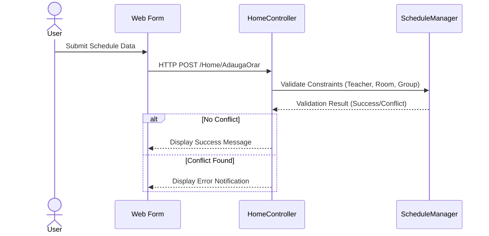

# UCSS - University Course Scheduling System

This project is a professional web-based application designed to manage and validate university course schedules. It is built using **ASP.NET Core MVC** and follows a robust **N-Layered Architecture**.

## 🏛️ System Architecture (Detailed Layered Approach)

The following diagram illustrates the high-level architecture of the UCSS project, showing the separation of concerns between the presentation, business logic, and data persistence layers.

```mermaid
graph TB
    %% Defining the Layers
    subgraph Layer1 ["View Layer - Frontend"]
        direction LR
        V1["Schedule Dashboard<br>(Bootstrap/Razor)"]
        V2["Input Forms<br>(Schedule Creation)"]
        V3["Resource Management<br>(UI Components)"]
    end

    subgraph Layer2 ["Controller Layer - API/MVC"]
        direction LR
        C1["ScheduleController<br>(HTTP POST/GET)"]
        C2["ConflictController<br>(Validation Endpoint)"]
    end

    subgraph Layer3 ["Service Layer - Business Logic"]
        direction TB
        subgraph SecurityMod ["Security Module"]
            Auth["Auth & Identity Service"]
        end
        
        S1["ScheduleService<br>(Orchestrator)"]
        
        subgraph LogicMod ["Validation Core"]
            S_Conf["ConflictDetectionService<br>(Rules Engine)"]
            S_Res["ResourceValidator"]
        end
    end

    subgraph Layer4 ["Repository Layer - Data Access"]
        direction LR
        R1["ScheduleRepository<br>(EF Core)"]
        R2["ResourceRepository<br>(Context Access)"]
    end

    subgraph Layer5 ["Data Layer - Persistence"]
        direction LR
        DB[("SQL Server DB")]
        Tables["Schedules/Teachers/Rooms"]
    end

    %% Interactions and Data Flow
    User(("User Browser")) -- "HTTPS/JSON Requests" --> C1
    C1 --> S1
    S1 --> S_Conf : "Invoke Validation"
    S1 --> R1 : "Fetch/Save Data"
    R1 --> DB : "Execute Queries"
```

---

## 📊 Technical Specifications

### 1. Class Structure
The core domain model and the management logic are decoupled to ensure maintainability.


### 2. Execution Flow (Sequence)
How the system processes a new schedule request:



---

## 🚀 Key Features & Technologies
- **Conflict Resolution Engine**: Advanced logic to prevent overlapping schedules for teachers, rooms, and student groups.
- **MVC Pattern**: Strict separation between data (Model), UI (View), and logic (Controller).
- **Modern UI**: Styled with Bootstrap for a responsive and interactive experience.
- **HTTP Methods**: Full implementation of `GET` for viewing and `POST` for secure data submission.

---
*Created for the UCSS University Project.*
