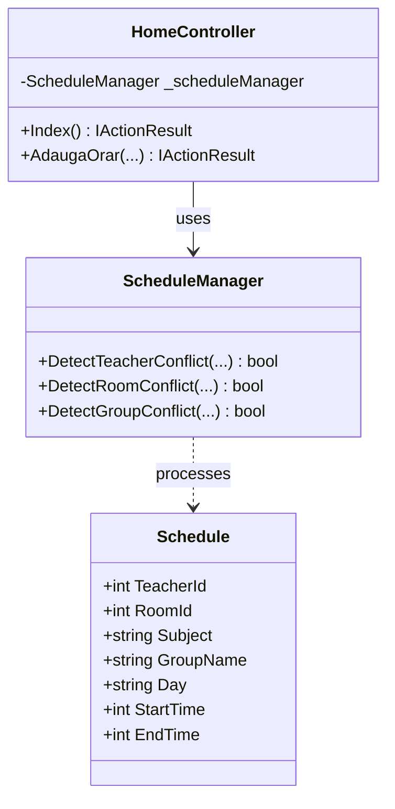
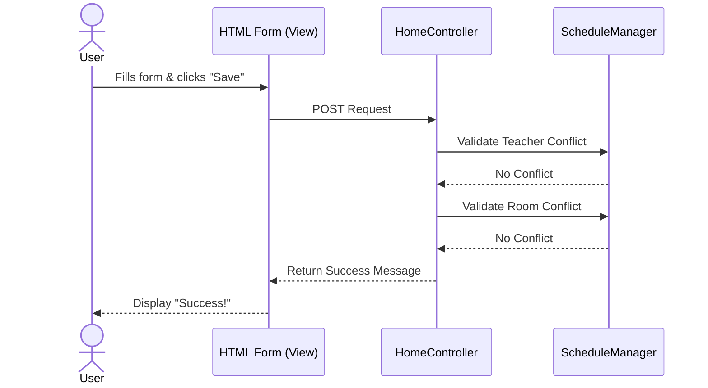

# UCSS - University Course Scheduling System

This project is a web-based application built using **ASP.NET Core MVC** designed to manage and validate university course schedules.

## 🏗️ General Architecture (MVC Pattern)

The application follows the **Model-View-Controller (MVC)** architectural pattern, which separates the application into three main components:

* **Model**: Represents the data and business logic (e.g., `Schedule` class and `ScheduleManager`).
* **View**: The user interface (HTML/CSS) that displays data to the user.
* **Controller**: The intermediary that handles user requests, interacts with the Model, and returns the appropriate View.

### HTTP Methods Used
| Method | Description | Usage in this Project |
| :--- | :--- | :--- |
| **GET** | Retrieve data from the server | Loading the "Add Schedule" page |
| **POST** | Submit new data to the server | Saving a new course schedule and checking for conflicts |
| **PUT** | Update existing data | (Future update) Editing an existing schedule |
| **DELETE**| Remove data | (Future update) Canceling a scheduled course |

---

## 📊 System Diagrams

### 1. Class Diagram
This diagram shows the structure of the classes and the relationships between them.

### 2. Sequence Diagram
This diagram illustrates the flow of information when a user saves a new schedule.

---

## 🛠️ Features
- **Teacher Conflict Detection**: Ensures a teacher is not scheduled for two courses at the same time.
- **Room Conflict Detection**: Prevents two courses from being held in the same room simultaneously.
- **Group Conflict Detection**: Ensures a student group doesn't have overlapping classes.
- **Modern UI**: Interactive web interface built with Bootstrap.
