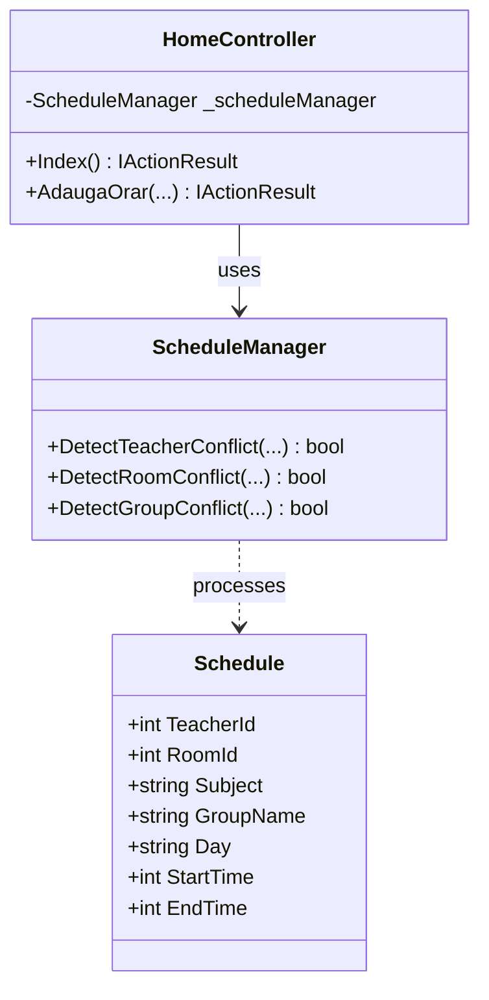
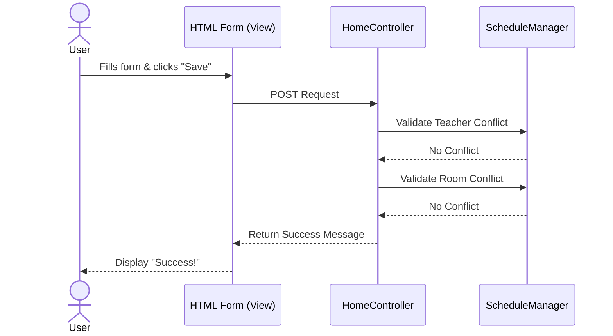

```mermaid
classDiagram
    class Schedule {
        +int TeacherId
        +int RoomId
        +string Subject
        +string GroupName
        +string Day
        +int StartTime
        +int EndTime
    }

    class ScheduleManager {
        +DetectTeacherConflict(...) bool
        +DetectRoomConflict(...) bool
        +DetectGroupConflict(...) bool
    }

    class HomeController {
        -ScheduleManager _scheduleManager
        +Index() IActionResult
        +AdaugaOrar(...) IActionResult
    }

    HomeController --> ScheduleManager : uses
    ScheduleManager ..> Schedule : processes
```

### 2. Sequence Diagram
This diagram illustrates the flow of information when a user saves a new schedule.

```mermaid
sequenceDiagram
    actor User
    participant View as HTML Form (View)
    participant Controller as HomeController
    participant Manager as ScheduleManager
    
    User->>View: Fills form & clicks "Save"
    View->>Controller: POST Request
    Controller->>Manager: Validate Teacher Conflict
    Manager-->>Controller: No Conflict
    Controller->>Manager: Validate Room Conflict
    Manager-->>Controller: No Conflict
    Controller-->>View: Return Success Message
    View-->>User: Display "Success!"
```
